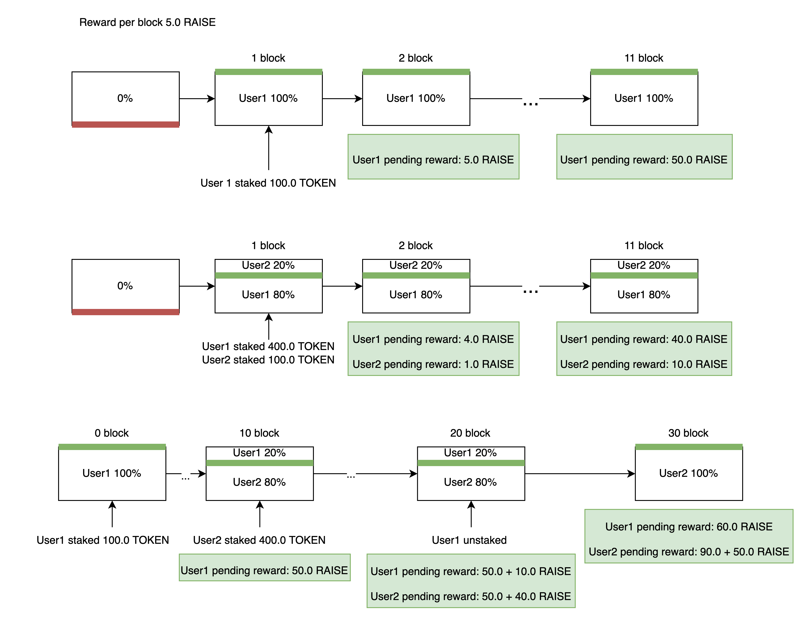

# The raise finance project contracts

## Staking

#### Arbitrum rinkeby

- Staking address: `0x984A8746Bacb613F74FDB9934eba00aD911f3Ed3`
- Verification link: https://goerli-rollup-explorer.arbitrum.io/address/0x984A8746Bacb613F74FDB9934eba00aD911f3Ed3#code

- Token address: `0x00eA238b9Afbc808F03a4884CBc88f407489338D`

- USDC address: `0x9b6D5D0fd667E685D73E18E1b8dB8f6245df0f19`
- USDT address: `0x7412fc4d2a3c1c24739845b1079B5bb0097AbBE5`
- DAI address: `0x4B0e8DAfd97679a1e393330F2B112160a97Cee73`

#### zkSync goerli

- Staking address: `0xD9a724b34DAa4EC1bC1e5585D608064C5Ad628c9`
- Zkscan link: https://explorer.zksync.io/address/0xD9a724b34DAa4EC1bC1e5585D608064C5Ad628c9

- Token address: `0x790c8945225bbf7340d50c89b3F2a0CF95B3eA83`

- USDC address: `0x9f4fA1E9C27EfB6FE11DADfC4aa5E50d9ad2D426`
- USDT address: `0x5077B50F1Ed22c7E24eD8F8E10A3898C38cBb3DB`
- DAI address: `0xCECF7296e03F7753ADc58F39c647C90c5458259A`

- Multicall address: `0xc3012E740fff4A3034cBDA8e2bCC7B5b5d6D93CE`

This contract contains sushi-like staking implementation architecture described bellow in the architecture section. User can stake RAISE tokens or other and get a staking reward. A tier is acqired to user based on staked raise tokens.

### Useful commands:

#### Arbitrum rinkeby

- Deploy to testnet and verify:<br>`npx hardhat deployStaking --token-addr 0x00eA238b9Afbc808F03a4884CBc88f407489338D --raise-per-block 1.0 --network arbitrumTestnet`
- Deploy token to testnet:<br>`npx hardhat deployToken --network arbitrumTestnet`
- Change owner:<br>`npx hardhat changeStakingOwnerAddr --staking-addr 0x984A8746Bacb613F74FDB9934eba00aD911f3Ed3 --new-owner-addr 0x838aec1c2565a5D660BB7F0C540d2632A40B0d5b --network arbitrumTestnet`
- Fund service:<br>`npx hardhat fund --staking-addr 0x984A8746Bacb613F74FDB9934eba00aD911f3Ed3 --token-addr 0x00eA238b9Afbc808F03a4884CBc88f407489338D --amount 100000.0 --network arbitrumTestnet`

#### zkSync goerli

- Deploy to testnet:<br>`ZK=1 npx hardhat deployStaking --token-addr 0x790c8945225bbf7340d50c89b3F2a0CF95B3eA83 --raise-per-block 0.25 --network zkSyncTest`
- Deploy token to testnet:<br>`ZK=1 npx hardhat deployToken --network zkSyncTest`
- Change owner:<br>`ZK=1 npx hardhat changeStakingOwnerAddr --staking-addr 0xFE0882475E19C6Cf6daC77dB3c592a123b61f461 --new-owner-addr 0x838aec1c2565a5D660BB7F0C540d2632A40B0d5b --network zkSyncTest`
- Fund service:<br>`ZK=1 npx hardhat fund --staking-addr 0xFE0882475E19C6Cf6daC77dB3c592a123b61f461 --token-addr 0x17fD6bb20E2178d08Df93211362D1d06dBD1f82D --amount 100000.0 --network zkSyncTest`
- Stake:<br>`ZK=1 npx hardhat stake --staking-addr 0x5077B50F1Ed22c7E24eD8F8E10A3898C38cBb3DB --pool-id 0 --staking-time 0 --amount "1.0" --token-addr 0xc3012E740fff4A3034cBDA8e2bCC7B5b5d6D93CE --network zkSyncTest`

### Usage tips

#### Constructor

- `constructor(address raiseTokenAddr, uint256 raisePerBlock_)`
  > Receives address of the raise token and raise per block amount (like 0xD9a724b34DAa4EC1bC1e5585D608064C5Ad628c9, 5000000000000000000)

#### Public functions

- `function createPool(uint256 allocPoints_, address tokenAddr) public onlyOwner`

  > Can be used to create a staking pool for new token. allocPoints\_ is a share of the pool in the service reward distribution.

- `function stake(uint256 poolId, uint256 amount, StakingTime time) public whenNotPaused`

  > Use it to stake _amount_ tokens for a time. Pool id determines the token to stake.
  > If user have any pending staking reward, it is withdrawn to the user
  > Pool id is zero if you're staking **RAISE** tokens.
  >
  > > StakingTime variants: <br>
  > >
  > > - 0 for a month<br>
  > > - 1 for three months<br>
  > > - 2 for six months<br>
  > > - 3 for a year<br>
  > >
  > > Emits<br> > `event Staked(address indexed user, uint256 indexed poolId, uint256 amount, uint256 reward, StakingTime time);`<br> > `event Claimed(address indexed user, uint256 indexed poolId, uint256 reward);` If collected reward autoclaimed to user<br> > `event TierObtained(address user, Tier tier)` if tier changed

- `function updatePool(uint256 poolId) public whenNotPaused`

  > Updates the current pool accRaisePerShare / lastRewardBlock (see architecture section). Mostly for internal use.

- `function unstake(uint256 poolId, uint256 amount) public whenNotPaused`

  > If called before staking deadline, user will pay a stake penalty
  > If user have any pending staking reward, it is withdrawn to the user
  > Pool id is zero if you're staking **RAISE** tokens.<br>
  > Emits<br> > `event Unstaked(address indexed user, uint256 indexed poolId, uint256 amount, uint256 reward)`<br> > `event Claimed(address indexed user, uint256 indexed poolId, uint256 reward);` If collected reward autoclaimed to user

- `function claim(uint256 poolId) public whenNotPaused`

  > Withdraws pending staking reward to the user.<br>
  > Pool id is zero if you're staking **RAISE** tokens.<br>
  > Emits<br> > `event Claimed(address indexed user, uint256 indexed poolId, uint256 reward);`

- `function fund(uint256 amount) public`

  > Use it to transfer **RAISE** token to the service reward pool<br>
  > Emits<br> > `event Funded(address indexed user, uint256 amount);`

- `function withdraw(uint256 amount) public onlyOwner`

  > Use it to transfer **RAISE** token from the service reward pool<br>
  > Emits<br> > `event Withdrawed(address indexed user, uint256 amount);`

- `function setAllocPoints(uint256 poolId, uint256 allocPoints) public onlyOwner`

  > Use it to change weight of the pool in the reward distribution.

- `function setPenaltyPercent(uint8 penaltyPercent_) public onlyOwner`

  > Use it to set the penalty percent for early unstake

- `function setRaisePerBlock(uint256 newRaisePerBlock) public onlyOwner`
  > Changes the raise per block

#### View functions

-

```solidity
    function getUserInfo(address user)
        public view
        returns (
            uint256 userTickets,
            Tier tier,
            uint256 stake_,
            uint256 deadline,
            uint8 allocationBonusPercent,
            uint256 stakedAt
        )

```

> Returns user tickets amount, tier, stake, stake deadline and allocation bonus percent<br>
>
> > Tier variants:<br>
> >
> > - 0 is None<br>
> > - 1 is Fan<br>
> > - 2 is Merchant<br>
> > - 3 is Dealer<br>
> > - 4 is Broker<br>
> > - 5 is Tycoon<br>

- `function getUserStakeInfo(uint256 poolId, address user) public view returns (uint256 amount, uint256 deadline)`

  > Returns stake amount and deadline for user in selected pool<br>
  > Pool id is 0 for **RAISE** staking info

- `function getPendingReward(uint256 poolId, address user) public view returns (uint256 pendingReward)`

  > Returns pending _RAISE_ tokens reward for user in a pool.

- `function getStakersByTier(Tier tier) public view returns(address[] memory)`

  > Returns staker addresses who have a specific tier

- `function getStakerLotteryInfos(Tier tier) public view returns (StakerLotteryInfo[] memory userInfos)`
  > Returns stakers by tier with info for the lottery

```solidity
struct StakerLotteryInfo {
  uint256 tickets;
  uint256 stakedAt;
  address user;
  uint8 allocationBonusPercent;
}

```

- `function getStakedTokenAmount(uint256 poolId) public view returns (uint256)`

  > Returns pool balance

- `function getTierByStakingAmount(uint256 amount) public view returns (Tier tier)`

  > Returns what tier will user achieve if staked amount tokens

- `function getPeriodDuration(StakingTime time) public pure returns (uint256 period)`

  > Convers StakingTime the actual duration in seconds

- `function getAllocationBonusPercentByTime(StakingTime time) public pure returns (uint8)`
  > Convers StakingTime the actual duration in seconds

### Design solutions

The staking collects reward each block passed. The reward distrubutes between pools based on their weights - allocation points. Inside pool reward distributes between users according to user stake shares.

Let's consider distrubution inside a poll if we have only one pool and user ustaked after his deadline


_Test cases_

If we have more than one pool the situation would be the same but block reward per pool will be less. It be distrubuted according to the pool allocation points.

### Implementation notes

Each pool stores accRaisePerShare which is updated every user stake / unstake.
Let's consider a pool balance over time


If we define accRaisePerShareExpression as

<!-- $rewardPerBlock * (\frac{period_1 * poolShare_1}{balance_1} + \frac{period_2 * poolShare_2}{balance_2} + \frac{period_3 * poolShare_3}{balance_3} + ...) $ --> 

where

<!-- $poolShare_t = \frac{pool.allocPoint_t}{totalAllocPoint_t}$ --> 

If we multiply accRaisePerShareExpression by current user balance, the result would be

<!-- $period_1 * poolShare_1\frac{userBalance}{balance_1} + period_2 * poolShare_2\frac{userBalance}{balance_2} + period_3 * poolShare_3\frac{userBalance}{balance_3}$ --> 

What is exactly the reward earned by the user in the total period. We store also rewardDebt for user in a pool which is the the paid reward

But when we divide period1 / balance1 we actually divide the smaller number by the larger one. So we need some kind of fractional numbers. For such reason we will multiply terms by a big number, `1e12` in our case to implement something like fixed point arithmetics. So
accRaisePerShare is

<!-- $rewardPerBlock * (\frac{period_1 * 1e12 * poolShare_1}{balance_1} + \frac{period_2 * 1e12 * poolShare_2}{balance_2} + \frac{period_3 * 1e12 * poolShare_3}{balance_3} + ...) $ --> 

So the user reward in the total period can be calculated as `totalUserReward = userBalance * accRaisePerShare / 1e12`. Pending reward can be calculated as `totalUserReward - rewardDebt`. Where rewardDebt is already paid to user sum

We need to store users of a specific tier to return them for lottery distribution. So `mapping(Tier => address[]) public tierStakers` stores stakers by tier. But what happens if user tier changed. We need to remove user old tier info and set the new one. So we need to know user tier info index in `tierStakers` for a specific user. `mapping(address => uint256) public tierStakerPositions` is used for this reason. But what if we want to remove old user info from the middle of `tierStakers`. We need to shift the whole right part of the array to remove the gap which is expensive. Or we can to just write zero address to the gap and fill it with a new value later. `mapping(Tier => uint256[]) public tierStakerGaps` used to save gaps from removed user information and reuse the gaps if new user gets the tier.

## Sale factory

#### Arbitrum rinkeby

- Factory address: `0xaE8e3813849be020dBE84dC447BC3A818D0e3430`
- Verification link: https://testnet.arbiscan.io/address/0xaE8e3813849be020dBE84dC447BC3A818D0e3430#code

#### zkSync goerli

- Factory address: `0x61e14227eF05dA292536BA907d2fefbC878F2985`
- Zkscan link: https://zksync2-testnet.zkscan.io/address/0x61e14227eF05dA292536BA907d2fefbC878F2985#code

Contains ERC1967Proxy - based factory pattern implementation. Use it to create new sales.
Can be used to create ERC20 and ERC1155 sales

### Useful commands:

- Deploy to arbitrium and verify:<br>`npx hardhat deploySaleFactory --network arbitrumTestnet`
- Deploy to zkSync:<br>`ZK=1 npx hardhat deploySaleFactory --network zkSyncTest`

- Deploy project token to arbitrum:<br>`npx hardhat deployToken --network arbitrumTestnet`
- Deploy pay token to arbitrum:<br>`npx hardhat deployUSDC --network arbitrumTestnet`

- Deploy project token to zkSync:<br>`ZK=1 npx hardhat deployToken --network zkSyncTest`
- Deploy pay token to zkSync:<br>`ZK=1 npx hardhat deployUSDC --network zkSyncTest`


- Create ERC20 sale on zkSync:<br>`npx hardhat createSale --factory-addr 0x61e14227eF05dA292536BA907d2fefbC878F2985 --sale-owner 0x2836eC28C32E232280F984d3980BA4e05d6BF68f --sale-type 0 --pay-token-addr 0xBF3d47F19A98D3A1b7c6aa75f88F22C3FE873d41 --project-token-addr 0x17CC238aff7E7a1b4E6Ac431861c5CAC35F0b227  --minimum-amount-to-fund 10000 --is-withdraw-vesting-enabled 0 --service-fee-percent 10 --network zkSyncTest`

- Create ERC20 sale on arbitrum:<br>`npx hardhat createSale --factory-addr 0xaE8e3813849be020dBE84dC447BC3A818D0e3430 --sale-owner 0x2836eC28C32E232280F984d3980BA4e05d6BF68f --sale-type 0 --pay-token-addr 0x14609E0f716B091b82625A2be6420bb47680C04a --project-token-addr 0x0A1F75C64179a7Ffd41650b8B8567BC4846DB3E6  --minimum-amount-to-fund 10000 --is-withdraw-vesting-enabled 0 --service-fee-percent 10 --network arbitrumTestnet`

- Fund ERC20 sale on arbitrum:<br>`npx hardhat fundSale --sale-addr 0xAA4A16940D602B98244a0200567CF5658DCFeE42 --token-addr 0x0A1F75C64179a7Ffd41650b8B8567BC4846DB3E6 --token-amount 1000000 --network arbitrumTestnet`

- Create new round on arbitrum:<br>`npx hardhat createRound --sale-addr 0x4048DF6440bf08893Bc3247cC3BebC2E52457e3C --required-tier 3 --max-allocation 100000 --max-allocation-per-user 8000 --period-seconds 604800 --token-price 400000 --whitelist 0x838aec1c2565a5D660BB7F0C540d2632A40B0d5b --allocation-bonuses 10 --network arbitrumTestnet`

- Create new round on zkSync:<br>`npx hardhat createRound --sale-addr 0x1c80c72b7D1BCd6fE3188e68ccb48EF58E244204 --required-tier 3 --max-allocation 100000 --max-allocation-per-user 8000 --period-seconds 604800 --token-price 400000 --whitelist 0x838aec1c2565a5D660BB7F0C540d2632A40B0d5b,0x2836eC28C32E232280F984d3980BA4e05d6BF68f --allocation-bonuses 10,20 --network zkSyncTest`

- Buy in round on zkSync:<br>`npx hardhat buy --sale-addr 0x1c80c72b7D1BCd6fE3188e68ccb48EF58E244204 --pay-token-amount 0.1 --pay-token-addr 0x2AfE245FF33976b13C325F6321f315b081609DE1 --whitelist 0x838aec1c2565a5D660BB7F0C540d2632A40B0d5b,0x2836eC28C32E232280F984d3980BA4e05d6BF68f --allocation-bonuses 10,20 --network zkSyncTest`

- Stop round:<br>`npx hardhat stopRound --sale-addr 0xcAfFb55Bf736622Ec06acB487356874D48978880 --network arbitrumTestnet`

- Run lottery:<br>`ZK=1 npx hardhat lottery --staking-addr 0x370985919C756677411114b054800D4D6Cb9B01b --tier 2 --users-to-choose-num 500 --registered-users 0x2836eC28C32E232280F984d3980BA4e05d6BF68f,0x838aec1c2565a5D660BB7F0C540d2632A40B0d5b --network zkSyncTest`
### Usage tips

#### Constructor

- `constructor(address erc20SaleContractAddr_, address erc1155SaleContractAddr_)`
  > Receives address of the erc20 sale contract, etc1155 sale contract, staking contract addresses

#### Public functions

```solidity
    function createSale(
        address saleOwner,
        SaleType saleType,
        address payTokenAddr,
        address projectTokenAddr,
        uint256 minimumAmountToFund,
        bool isWithdrawVestingEnabled,
        uint8 serviceFeePercent
    )
        public onlyOwner
```

> Use it to create a new sale for an integradet project or _RAISE_ token sale<br>
> saleOwner – address of the integrated project owner<br>
> saleType type of the sale, ERC20 / ERC1155<br>
> payTokenAddr - address of the token in which we accept donations<br>
> projectTokenAddr - address of the project project token<br>
> minimumAmountToFund - minimum amount to fund in project token<br>
> isWithdrawVestingEnabled – is withdraw vesting can be set by raise admin for project owner<br>
> serviceFeePercent – service fee percent<br>
>
> > SaleType variants<br>
> >
> > - 0 is ERC20<br>
> > - 1 is ERC1155<br>

- `function updateSaleContract(SaleType saleType, address newSaleContractAddr) public onlyOwner`
  > Use it to change sale contract address of the desired type

#### View functions

- `function getTotalSalesNum() public view returns (uint256)`

  > Use it to get the total amount of sales. ERC20 + ERC1155

- `function getSalesNum(SaleType saleTye) public view returns (uint256)`

  > Use it to get the amount of sales of the specific sale type.
  >
  > > SaleType variants<br>
  > >
  > > - 0 is ERC20<br>
  > > - 1 is ERC1155<br>

- `function getSales(SaleType saleTye) public view returns (address[] memory)`

  > Use it to get the sales addresses of a specific sale type

- `function isCreatedByFactory(address saleAddress_) public view returns (bool)`
  > Returns is sale created by the factory

## Sale ERC20

#### Arbitrum rinkeby

- Actual address: `0x6cB5368d2fDcCb9Dd3254e0A941Ad74Ac4cA9A8f`
- Verification link: https://testnet.arbiscan.io/address/0x6cB5368d2fDcCb9Dd3254e0A941Ad74Ac4cA9A8f#code

#### zkSync goerli

- Actual address: `0xAd451F0bAf2a6aA7d8b3F97a4Bd504A9E8A78594`
- Zkscan link: https://explorer.zksync.io//address/0xAd451F0bAf2a6aA7d8b3F97a4Bd504A9E8A78594


This contract contains token sale implementation. Users who staked tokens and acquired tiers can participate in sale. Users get allocation bonus and chances to participate based on their tiers and staking times.

There are two main persons of the sale: sale owner and raise admin. Sale owner is an integrated project representative. He manages the sale while there are no emergency situations. If there are any problems with the project, raise admin can manage the situation by setting withdraw vesting or marking project as an unhealthy.

First sale owner can optionally set up a vesting schedule by calling.
`function setVestingSchedule(uint256[] calldata claimTimes_, uint8[] calldata claimPercents_)`

Example params

```js
setVestingSchedule(
  [
    new Date("2022.08.20").getTime() / 1000,
    new Date("2022.08.21").getTime() / 1000,
    new Date("2022.08.23").getTime() / 1000,
  ],
  [20, 30, 50]
);
```

It means users can withdraw 20% of his bought tokens on 2022.08.20, next 30% on 2022.08.21, and the final half on 2022.08.23

By default schedule params are `([block.timestamp], [100])` which means that users can withdraw tokens immediately after buying

Then owner can create round by calling

```solidity
    function createRound (
        Tier requiredTier,
        uint256 maxAllocation,  // In project tokens
        uint256 maxAllocationPerUser, // In project tokens
        uint256 periodSeconds,
        uint256 tokenPrice,  // tokenPrice = 10.0 => 1 projectToken = 10 usdt
        bytes32 userInfoRoot

    )
```

### Usage tips

#### Public functions

- `function fund(uint256 amount) public`

  > Use it to add tokens to be sold<br>
  > Emits<br>`event Funded(address indexed user, uint256 amount)`<br>

- `function withdraw() public onlySaleOwner`

  > Function for sale owner to withdraw tokens that was not sold after sale ended<br>
  > Emits<br>`event Withdrawed(address indexed user, uint256 amount)`<br>

- `function emergencyWithdraw() public onlyRaiseAdmin ifProjectUnhealthy`

  > Use it to emergency withdraw tokens to be sold from the service. Project needs to be marked as an unhealthy first<br>
  > Emits<br>`event Withdrawed(address indexed user, uint256 amount)`<br>

-

```solidity
    function createRound (
        Tier requiredTier,
        uint256 maxAllocation,  // In project tokens
        uint256 maxAllocationPerUser, // In project tokens
        uint256 periodSeconds,
        uint256 tokenPrice,  // tokenPrice = 10.0 => 1 projectToken = 10 usdt
        bool isFinal,  // Is final round
        bytes32 userInfoRoot
    )
        public onlySaleOwner
```

> Use it to create a round<br>
> Sale supports only one ongoing round at the samw time so you need to stop previous round to launch a new one. Or wait for it's deadline.<br>
> Only whitelisted users can participate the round<br>
> Max allocation - amount of project tokens users can buy during the round<br>
> Max allocation per user - amount of project tokens one user can buy during the round<br>
>
> > Emits<br>`event RoundStarted(uint256 indexed id, Tier indexed requiredTier, uint256 deadline)`<br>

- `function stopRound(uint256 roundId) public onlySaleOwner`

  > Use it to finish a round by id

- `function buy(uint256 payTokenAmount, uint8 allocationBonusPercent, bytes32[] memory proof) public whenNotPaused onlyHealthy`

  > Users call this functions to buy _project tokens_ for _pay tokens_<br>. Users pass here their allocation bonus and merkle proof
  > Emits<br>`event Bought(address indexed user, uint256 amount);`

- `function claim() public whenNotPaused`

  > Users call this function to claim bought tokens <br>
  > Emits<br>`event Claimed(address indexed user, uint256 amount);`

- `function withdrawRaisedFunds() public onlySaleOwner onlyHealthy`

  > Use it to witdraw the tokens paid by users<br>
  > Emits<br>`event RaisedFundsWithdrawn(uint256 amount, uint256 actualAmount, uint256 fee);`

- `function emergencyWithdrawRaisedFunds() public onlyRaiseAdmin ifProjectUnhealthy`

  > Use it to witdraw raised funds from the service in case of emergency<br>
  > Emits<br>`event RaisedFundsWithdrawnEmergency(uint256 amount);`

- `function setVestingSchedule(uint256[] calldata claimTimes_, uint8[] calldata claimPercents_) public onlySaleOwner`

  > Can be used to set vesting schedule
  > Example params
  >
  > ```js
  > setVestingSchedule(
  >   [
  >     new Date("2022.08.20").getTime() / 1000,
  >     new Date("2022.08.21").getTime() / 1000,
  >     new Date("2022.08.23").getTime() / 1000,
  >   ],
  >   [20, 30, 50]
  > );
  > ```
  >
  > This means users can withdraw 20% of his bought tokens on 2022.08.20, next 30% on 2022.08.21, and the final half on 2022.08.23<br>
  > Default schedule params are `([block.timestamp], [100])` which means that users can withdraw tokens immediately after buying<br>

- `function setWithdrawScheduleForSaleOwner(uint256[] calldata withdrawTimes, uint8[] calldata withdrawPercents) public onlyRaiseAdmin ifWithdrawVestingEnabled`

  > Use it to set vesting schedule for owner of the project

- `function shiftVestingSchedule(uint256 secondsToShift) public onlySaleOwner`

  > Use it to shift the already set schedule. Can be used to restart vesting every month / year

- `function shiftSaleOwnerWithdrawSchedule(uint256 secondsToShift) public onlyRaiseAdmin ifWithdrawVestingEnabled`

  > Use it to shift the already set withdraw schedule for sale owner

- `function setIsUnhealthy() public onlyRaiseAdmin`
  > Use it to mark project unhealthy

#### Constructor

- ```solidity
    function initialize(
        address raiseAdmin_,
        address saleOwner_,
        address payTokenAddr,
        address projectTokenAddr,
        uint256 minimumAmountToFund_,
        bool isWithdrawVestingEnabled_,
        uint8 serviceFeePercent_
    )
        public initializer
  ```


> Please do not initialize sale contract directly. Use contract factory


#### View functions

- `function getOngoingRound() public view returns (Round memory)`
> Returns ongoing round if launched

-
```solidity
    function getOngoingRoundInfo()
        public view
        returns (
            uint256 id,
            uint256 deadline,
            Tier requiredTier,
            uint256 tokenPrice,
            uint256 maxAllocation,
            uint256 maxAllocationPerUser
        )
```

> Like previous one buy more handy for frontend I guess

- `function canParticipate(address user) public view returns (bool)`

  > Is user can participate in the ongoing round

```solidity
function getClaimInfo(address user) 
        public view 
        returns (
            uint256 amountToClaim, 
            uint256[] memory claimTimes_, 
            uint8[] memory claimPercents_
        ) 
```

  > Returns amount to claim for user, claim times and claim percents

- `function totalRaised() public view returns (uint256)`
  > Returns amount of pay tokens users paid

### Design solutions

Sale intended to hold an integrated project sale. Sale containst multiple rounds, one round per users of one tier. Admin passes whitelist and allocation bonuses for a round. During the round whiltlisted users can buy _project tokens_ for _pay tokens_. Users can claim their bought tokens according to the vesting schedule. Is withdraw vesting is enabled, project owner can withdraw raised funds only according to the schedule raise admin set. If something goes wrong with the project, we mark it as an unhealthy and forbid owner to witdraw funds. Also in such case users are allowed to get their funds back by calling the `refund` function. Then in the end _raise admin_ can call `emergencyWithdrawRaisedFunds` function to get the remaining funds

How claiming and vesting schedule works.
User intended to buy some token up to limit. We know how much tokens user bought and witdrawed during the sale.
So we can calculate the percent withdrawn. We also know what percent to give to user by looking up the vesting schedule. If percent to give is greater the percent withdrawn, we'll give the difference

## Sale ERC1155

#### Arbitrum rinkeby

- Actual address: `0x5be4eeAc2F29477d0078C14F4D2727637529c69B`
- Verification link: https://testnet.arbiscan.io/address/0x5be4eeAc2F29477d0078C14F4D2727637529c69B#code

#### zkSync goerli

- Actual address: `0xee51adc032327839F4D0Cb1e3EBA4BAe05ea7f82`
- Zkscan link: https://zksync2-testnet.zkscan.io/address/0xee51adc032327839F4D0Cb1e3EBA4BAe05ea7f82#code

## Multicall

#### zkSync goerli

- Actual address: `0xc3012E740fff4A3034cBDA8e2bCC7B5b5d6D93CE`
- Zkscan link: https://zksync2-testnet.zkscan.io/address/0xc3012E740fff4A3034cBDA8e2bCC7B5b5d6D93CE#code

### Useful commands:

- Deploy multicall on zkSync:<br>`ZK=1 npx hardhat deployMulticall --network zkSyncTest`

### Tests

- Lottery tests
- ✔ If there is only one user, lottery will choose him (224ms)
- ✔ If we want to choose ten users out of ten, all the users will be choosen (591ms)
- ✔ If we want to choose 5 users out of 15, only 5 will be choosen for fan, merchant and dealer tiers with no duplicates (450ms)
- ✔ If we want to choose 5 users out of 15, statistical distribution will be correct (156ms)

- Sale ERC20
- ✔ Check only sale owner can withdraw (52ms)
- ✔ Test that sale owner can't withdraw until end round ended
- ✔ Test funding and withdrawing (146ms)
- ✔ Test that impossible to create a round after final one (67ms)
- ✔ Test that user can't create round if service is not funded (71ms)
- ✔ Test round creation
- ✔ Check that admin can't create round if there an active one
- ✔ Check that admin create a new round if stopped current one (41ms)
- ✔ Check that regular user or sale owner can't create round
- ✔ Test that not whitelisted users can't participate event (56ms)
- ✔ Test that user can't buy more than user allocation (64ms)
- ✔ Test buying (84ms)
- ✔ Test project token withdrawing (72ms)
- ✔ Test raised withdrawing (78ms)
- ✔ Test that it's impossible to withdraw twice (83ms)
- ✔ Test withdrawing from multiple rounds (114ms)
- ✔ Test user can't withdraw more than round allocation (66ms)
- ✔ Test user can buy tokens regarding his allocation bonus (51ms)
- ✔ Test user can't buy more tokens then he can regarding the allocation bonus (48ms)
- ✔ Test ownership transferring
- ✔ Test claiming in case round time is default (70ms)
- ✔ Test that double claim is impossible (70ms)
- ✔ Test claiming with custom vesting schedule (250ms)
- ✔ Test claiming with custom vesting schedule shifting (210ms)
- ✔ Test incorrect vesting params
- ✔ Check ongoing round (74ms)
- ✔ Test pausing (47ms)
- ✔ Test allocation bonus and whitelisting correctness (91ms)
- ✔ Check raise admin can't withdraw if project is healthy
- ✔ Check raise admin transferring
- ✔ Check user can't buy and owner can't withdraw profit if project is unhealthy
- ✔ Check admin can't set or shit withdraw vesting if it's not enabled
- ✔ Test withdrawing with withdraw schedule (188ms)
- ✔ Test withdrawing with shifted withdraw schedule (176ms)
- ✔ Test emergency profit withdrawing by admin (158ms)
- ✔ Test incorrect withdraw vesting params (40ms)
- ✔ Test refunding (108ms)
- ✔ Test refunding case if first user donated 2/3, second 1/3. Owner withdrawn 1/2 (187ms)
- ✔ Test service fee changing
- ✔ Check admin can withdraw tokens project tokens if project is unhealthy (42ms)
- ✔ Test usdc sale with price 100 (89ms)
- ✔ Test usdc sale with price 0.01 (92ms)
- ✔ Test token price can't be zero
- ✔ Test user can't buy if sum is too low (53ms)
- ✔ Check sale is finished after if final round is stopped (71ms)

- Sale factory
- ✔ Test erc20 sale creation (62ms)
- ✔ Check that it's impossible to create a valid sale with invalid implementation
- ✔ Test sale amount correctness (769ms)
- ✔ Test sale pagination (558ms)
- ✔ Check is created by factory correctness (59ms)
- ✔ Test that only owner can create sale
- ✔ Test that only owner can update sale contract

- Staking
- ✔ Test platform initialization
- ✔ Test period calculation
- ✔ Test tier by staking amount calculation (56ms)
- ✔ Test tier by staking amount calculation if required stake changed (75ms)
- ✔ Test allocation bonus calculation
- ✔ Test staking (79ms)
- ✔ Test consequential tier achieving (230ms)
- ✔ Check that user can't stake zero tokens
- ✔ Test unstaking without penalty (79ms)
- ✔ Test that user can't unstake twice (76ms)
- ✔ Test emergency unstaking without penalty (57ms)
- ✔ Test user can't emergency unstaking if he has no stake
- ✔ Test unstaking without penalty if user has fan tier (67ms)
- ✔ Test unstaking with penalty (91ms)
- ✔ Test emergency unstaking with penalty (74ms)
- ✔ Check that user can't unstake more than he have
- ✔ Test reward withdrawing after second stake (75ms)
- ✔ Test claiming (68ms)
- ✔ Check that user can't claim is service has no funds (77ms)
- ✔ Test ticket calculation (162ms)
- ✔ Test stakers info fetching (261ms)
- ✔ Test null address info fetching
- ✔ Test ticket info collection (225ms)
- ✔ Test case if service has no funds (146ms)
- ✔ Check that admin can't create two pools for the same token
- ✔ Check pool reward distribution (123ms)
- ✔ Test staking pausing (102ms)
- ✔ Test double unstaking (181ms)
- ✔ Test money withdrawing
- ✔ Test user can't withdraw more money than service have 
- ✔ Test staked token amount correctness (72ms)
- ✔ Test staking with lower deadline (74ms)
- ✔ Check zero pending reward in non-zero pools
- ✔ Check raise per block changing
- ✔ Check raise per block and allocation points changing
- ✔ Test that only owner can create a new pool
- ✔ Test that only owner can withdraw
- ✔ Test that only owner can set allocation points
- ✔ Test that only owner can set prenalty percent
- ✔ Test that only owner can set raise per block
- ✔ Test that only owner can set required stake for tier
- ✔ Test that only owner can pause the contract
- ✔ Test that only owner can unpause the contract


- 99 passing (52s)

| File                          |  % Stmts | % Branch |  % Funcs |  % Lines |Uncovered Lines |
|-------------------------------|----------|----------|----------|----------|----------------|
| SaleERC20.sol                 |      100 |    97.26 |      100 |      100 |                |
| SaleFactory.sol               |      100 |      100 |      100 |      100 |                |
| Staking.sol                   |    99.23 |    97.32 |      100 |    99.42 |            134 |
| Tier.sol                      |      100 |      100 |      100 |      100 |                |
